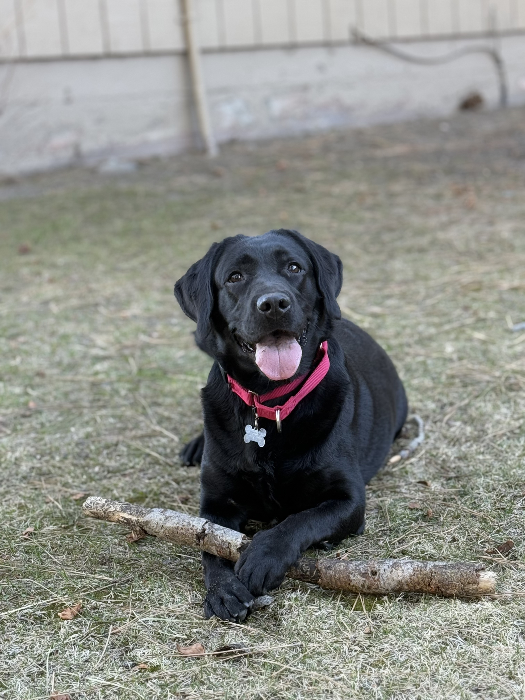
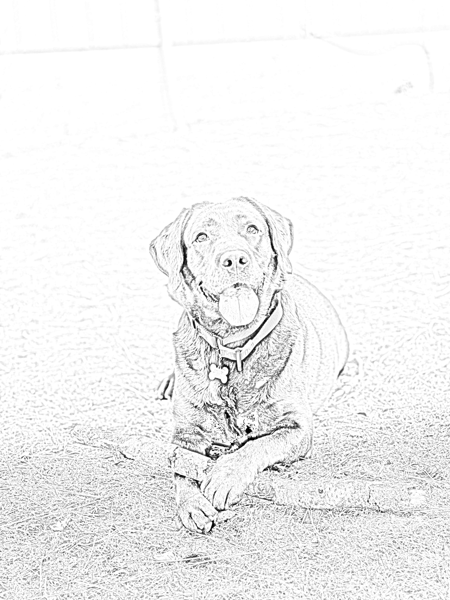

# image-to-pencil-sketch
Transform an image into a pencil sketch using OpenCV

# 🖼️ Image to Pencil Sketch with OpenCV

This project transforms a colored image into a pencil sketch using basic image processing techniques with OpenCV in Python. It's designed as a simple, visual data project ideal for portfolio or educational use.

This project is inspired by a StrataScratch problem. The dataset is not included due to licensing restrictions.

Originally inspired by a data science internship assignment from LetGrowMore (LGM).

---

## 📌 Project Objective

Given a colored JPEG image, simulate a pencil sketch using the following steps:
1. Convert the image to grayscale
2. Invert the grayscale image
3. Apply Gaussian blur to the inverted image
4. Invert the blurred image
5. Divide the grayscale image by the inverted blurred image to generate the sketch

---

## 🛠️ Tech Stack

- Python 3.11
- Jupyter Notebook
- OpenCV (`opencv-python-headless`)
- Matplotlib (for display)

---

## 📂 Files in This Repo

| File                  | Description                              |
|-----------------------|------------------------------------------|
| `pencil_sketch.ipynb` | The full Jupyter Notebook implementation |
| `dog.jpg`             | Sample input image                       |
| `sketch_result.jpg`   | Output sketch image                      |
| `README.md`           | Project description                      |

---

## 🖼️ Sample Result

| Original Image | Pencil Sketch |
|----------------|----------------|
|  |  |

---

## 🚀 How to Run This Project

### ✅ Option 1: Run via Jupyter Notebook
1. Clone this repository:
   ```bash
   git clone https://github.com/your-username/image-to-pencil-sketch.git

2. Navigate into the project folder:
   ```bash
   cd image-to-pencil-sketch
   
4. Launch the notebook:
   ```bash
   jupyter notebook
   
5. Run all cells in pencil_sketch.ipynb
